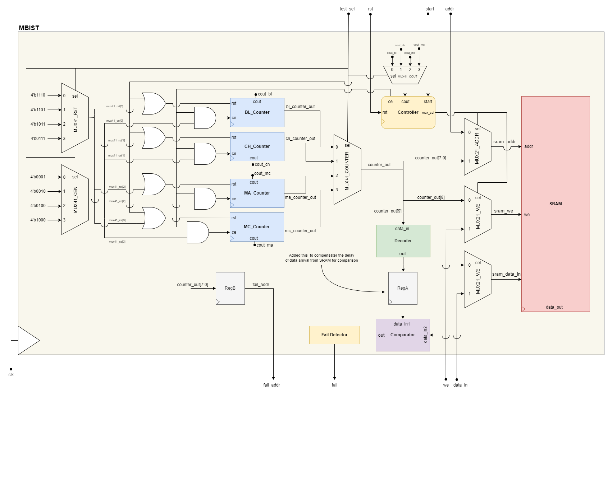

# SRAM 256x4b BIST
Built-In Self Test (BIST) is a method used in digital circuit and system design and testing to guarantee
proper operation and reliability. BIST allows self-testing and fault detection during operation without
requiring external testing equipment, which can decrease testing costs and enhance product quality. BIST
comprises embedded specialized hardware within the circuit to carry out self-tests. BIST circuits usually
have a test pattern generator, signature analyzer, and fault detector. The test pattern generator creates
test vectors that are used as inputs to the circuit, and the signature analyzer compares the circuit output
to anticipated results to detect faults. The fault detector identifies the type and location of any faults
detected by the BIST circuit. One of the main advantages of BIST is its ability to rapidly diagnose faults
and identify their location, which can save time and effort in repairing the circuit. Moreover, BIST can
be made to work during normal circuit operation, providing real-time monitoring and error detection
that can enhance system reliability. BIST is widely used in a variety of digital systems, including
processors, memory devices, and communication circuits. It is especially useful for complex systems that
are challenging to test using external equipment due to their size or integration level. In summary, BIST
is a valuable testing method for digital circuits and systems that offers an efficient and cost-effective
approach to ensuring proper operation and reliability. Its use of specialized embedded hardware and
fault detection capabilities can improve system quality, reduce testing costs, and save time in identifying
and repairing faults.

## Implmented Architecure
The four main components of an MBIST system are the decoder, comparator, controller, and counter. 

